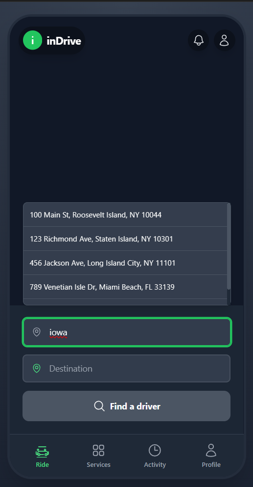
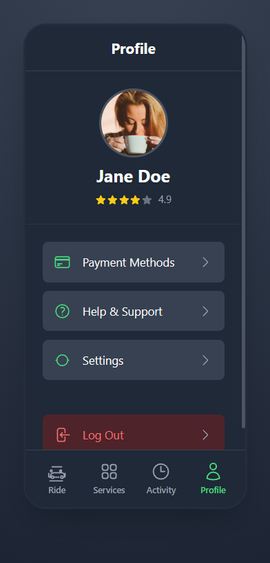
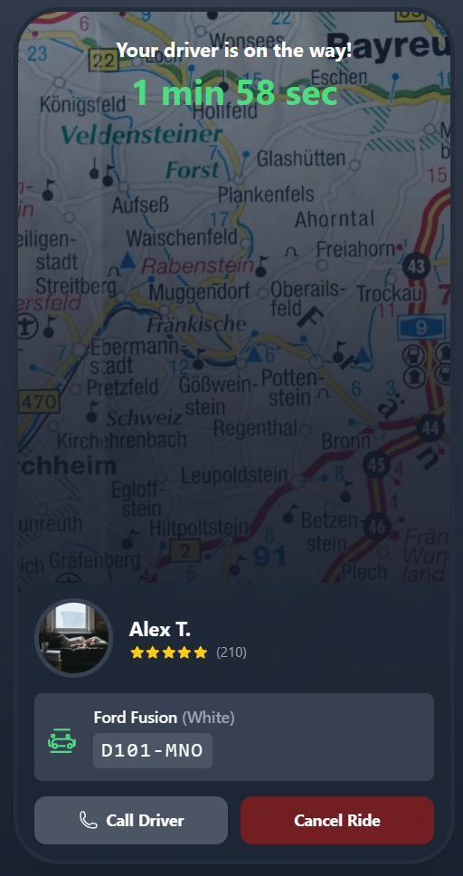

# InDrive Mobile UI Clone

## Overview
This project is a **frontend-only clone** of the **InDrive mobile app**, built using **React Native** (or any preferred mobile framework). The goal is to create a sleek, functional ride-hailing interface similar to the original app, with a focus on **smooth animations** and **modern design**.

## Features
The app has the following key screens and functionality:

### **Home Screen**:
- Displays fields for **Pickup Location** and **Destination**.
- A button labeled **“Find a Driver”** for the user to initiate the ride request process.
- Bottom navigation bar with options: **Ride**, **Services**, **Activity**, and **Profile**.

### **Address Search & Input**:
- A dynamic input field for selecting **Pickup Locations**.
- A list of previously entered locations with **scrollable options**.
- A field for the **Destination** input.

### **Smooth Navigation**:
- The app includes a fluid navigation system between different screens with **animated transitions**.

### **Visual Design**:
- Clean and modern UI with a **dark theme**, using **rounded input fields** and **flat icons** for a smooth experience.
- The top bar contains a **logo**, **notification icon**, and **profile icon**.

## Tech Stack
- **Framework**: React Native (with Expo or standard CLI)
- **Navigation**: React Navigation for handling screen transitions
- **State Management**: Recoil or Redux Toolkit for scalable state management
- **Animations**: React Native Reanimated 2, Lottie for advanced animations
- **Styling**: Styled Components or Tailwind CSS for clean, responsive styling
- **Images**: SVGs for scalable icons, Fast Image for optimized image loading
- **Performance**: React Native Hermes Engine for faster JS execution

## Installation
To run this app locally, follow these steps:

### Prerequisites
- **Node.js** (LTS version recommended)
- **React Native CLI** (or Expo CLI for easier setup)
- **Android Studio** (for Android) or **Xcode** (for iOS) for emulation

### Steps to Run
1. **Clone the repository**:
    ```bash
    git clone https://github.com/your-repo/inDrive-UI-clone.git
    ```

2. **Navigate to the project folder**:
    ```bash
    cd inDrive-UI-clone
    ```

3. **Install dependencies**:
    ```bash
    npm install
    ```

4. **Start the app**:
    - For Expo:
        ```bash
        expo start
        ```
    - For React Native (CLI):
        ```bash
        npx react-native run-android   # for Android
        npx react-native run-ios       # for iOS
        ```

## Screenshots
Here are a few screenshots of the app in action:

1. **Home Screen** displaying pickup and destination fields.  
   

2. **Address Input Screen** with previously entered locations.  
   

3. **Another Screen or Feature** (if you have a third screenshot).  
   
## License
This project is open-source and available under the **MIT License**.

---

### Developed by: @Br7eleven
